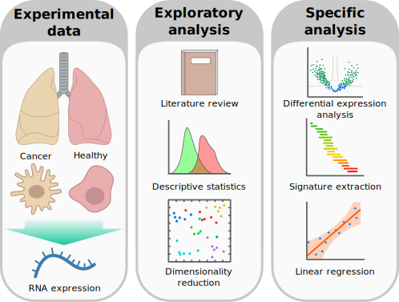

Project 4: Aberrant expression in metastatic lung cancer
========================================================

### *Project overview and guidelines*

-   [Introduction](#introduction)
-   [Objectives](#objectives)
    - [Exploratory analysis](#exploratory-analysis)
    - [Specific analysis](#specific-analysis)
-   [Description of data set](#description-of-data-set)
-   [Literature](#literature)
-   [How to structure your project](#how-to-structure-your-project)
    -   [Project proposal](#project-proposal)
    -   [Project must-have](#project-must-have)

Supervisors:

-   Nicolas Palacio
    ([nicolas.palacio@bioquant.uni-heidelberg.de](mailto:nicolas.palacio@bioquant.uni-heidelberg.de))
-   Aurelien Dugourd
    ([aurelien.dugourd@bioquant.uni-heidelberg.de](mailto:aurelien.dugourd@bioquant.uni-heidelberg.de))

Tutor:
- XXX ([XXX@YYY.ZZ](mailto:XXX@YYY.ZZ))

Introduction
------------

Cancer is a generic term for a heterogeneous group of diseases that arise in
different parts of the body. Cancer stems from genetic alterations that
transform normal cells into malignant cells. These malignant cells are
characterized by an uncontrolled growth and resistance to apoptosis (programmed
cell death). This malignant behavior is mainly achieved through genetic
alterations that affect the activity and wiring of many molecular mechanisms
like signaling and metabolic pathways. Therefore cancer cells hijack many
cellular processes enabling them to proliferate uncontrollably, avoid apoptosis
and/or immune response, migrate to other tissues (metastasis) or even obtain
drug resistance. Moreover, large-scale studies from international cancer
consortia have described that patients' tumors acquire this malignancy through
diverse individual molecular alterations. In other words, individual cancers
are different each other.

Lung cancer is one of the most common cancer types in the world and with high
mortality rates. Many studies have been already published showing potential
targets and already approved drugs are being used to treat this disease.
Nevertheless, due to the inherent heterogeneity of cancer and patients, finding
an easy way to characterize potential response or resistance to these
treatments is key to counteract the malignancy. This is especially true in
patients with very aggressive tumors, where time is key to maximize a positive
outcome. To tackle this problems, generating and analyzing comprehensive
biological data has shown to be the best approach.

Objectives
----------

You will be analyzing transcriptomic data from lung cancer patients (as well as
    normal lung samples for control) in order to find potential markers to
    stratify tumor types, stages and potential drug targets based on this
    expression data.

**NOTE:** The following exposed points are a suggestion, you are free to
perform your analysis using other tools or explore different aspects of the
data set. Just keep in mind what MUST be part of the project and that whatever
method you are applying has a clear purpose and justification (i.e. do not
    apply a tool or method just because you found it, but make sure it makes
    sense in your context and serves a clear purpose).

### Exploratory analysis

First, familiarize and explore the data by reviewing literature and performing
some basic descriptive statistics.

- Look up in the literature to find more about the data you are analyzing,
possible analyses that can be performed and/or what results you can expect.
- Explore gene expression profiles in cancer and healthy samples (e.g. density
plots, violin or box plots, profile/correlation heatmap...).
- Observe what type of data, which scale and ranges you are working with.

> Are the values raw gene counts, intensities? Are they in logarithmic scale?

- Assess whether if data needs to be normalized or if there is any experimental
bias (i.e. batch effect) across samples that should be addressed.

> Do they look already normalized?
> Could you identify number of batches from the data if any?

Explore the space of gene expression using dimensionality reduction methods
such as PCA, k-means, t-SNE or UMAP are among the most common.

- Relate the main latent factors to the sample groups (i.e. cancer types).

> Is there any co-variate that correlates with the main aspects of
transcriptional heterogeneity in the data set?

For this part of the analysis, you can use the metadata of the samples from
the original study. This table is provided as a comma-separated file (csv)
file along with the expression data of the project (cf.
[Description of the data set](#description-of-data-set) section).

### Specific analysis

Once you are familiar with the data, you can then address more specific
questions. First, choose a subtype of lung cancer of your interest to study in
further detail. Once chosen, a good place to start your specific analysis is by
performing a differential expression analysis. This allows you to extract which
genes are significantly up- or down-regulated in a given comparison, for
instance, cancer subtype vs. healthy.

- Perform a differential expression analysis and assess the significance using
t-test (one test per each gene). Samples of the same group can be considered
replicates (e.g. all healthy samples, all samples of a cancer type...).

Note that differential expression values are expressed in terms of fold change
(FC). This is the ratio between the comparing conditions (e.g. value of gene A
in condition X divided by the value of gene A in condition Y). Also note that
when working in logarithmic scale this is done by subtraction of the
log-values:

> log(FC) = log(X/Y) = log(X) - log(Y)

Once the significant changes are obtained, you may extract molecular or
functional signatures to identify relevant processes (e.g. signaling pathways)
from the data. One common approach is the use of enrichment methods, like Gene
Set Enrichment Analysis (GSEA).

- Extract relevant signatures from the results of the differential expression
of your contrast(s) of interest.

You can enforce or assess your results by contrasting them with the literature.

With your previous results you may have identified some genes or gene sets of
interest in your comparison. You can then try to fit a linear model of these
changes in increasing tumor stages or other covariates you find interesting
like metastatic and non-metastatic tumors.

Description of data set
-----------------------

Data source in GEO: https://www.ncbi.nlm.nih.gov/geo/query/acc.cgi?acc=GSE30219

The expression data set and the metadata of the samples is provided in the
[data](data/) folder of the repository. Please use this for your analyses as
the probe identifiers have been already translated to gene names and the
samples are named according to the cancer subclass instead of GEO identifiers.

- [expression_dataframe.csv](data/expression_dataframe.csv): Here you will
find the expression data of the different samples and transcripts. Rows are
the gene names and columns are the different samples according to the lung
cancer subtype.
- [sample_infos.csv](data/sample_infos.csv): The metadata of the samples. You
can find the name of the sample as provided in the expression_dataframe.csv
file, the gender, age and status of the patient, the TNM stage of the different
tumors (see [Literature](#literature) for more information), if the tumor has
relapsed and the follow-up time of the patients (in months), smoking habits and
if the patient has received chemo-/radiotherapy.

Data set comprises 293 lung tumor samples and 14 non-tumoral lung samples.
Tumor samples come from different subtypes of lung cancer and stages.

| Subclass | Abbreviation | Samples |
|---|---|---|
| Non-tumoral lung | NTL | 14 |
| Adenocarcinoma | ADC | 85 |
| Squamous Cell Tumours | SQC | 61 |
| Large cell neuroendocrine | LCNE | 56 |
| Basaloid tumours | BAS | 39 |
| Carcinoid tumours | CARCI | 24 |
| Small cell carcinoma | SCC | 21 |
| Other histology | Other | 7 |
| Total |  | 307 |

Literature
----------

#### Source study

- Original article [here](https://www.ncbi.nlm.nih.gov/pmc/articles/PMC4818008/?)
- Supplementary data [here](https://www.ncbi.nlm.nih.gov/pmc/articles/PMC4818008/bin/NIHMS771511-supplement-Supplementary_Materials.pdf).
You may find specially interesting for this project the supplementary table 7.

#### Computational methods

- Molecular Signature Database: [MSigDB](https://www.gsea-msigdb.org/gsea/msigdb/index.jsp)
- Gene Set Enrichment Analysis article: [GSEA](https://doi.org/10.1073/pnas.0506580102)

#### Other

- [TNM cancer staging nomenclature](https://www.cancer.gov/about-cancer/diagnosis-staging/staging)

How to structure your project
-----------------------------

### Project proposal

You first task will be to define a **project proposal**, which should include:

-   Summary of literature on this data set
-   Questions you want to address
-   Approximate timetable

You will present this project proposal together with a literature review on the
subject 3 week after the beginning of the semester (10 minute presentation + 5
minutes discussion).

### Project must-have

You project **MUST** contain the following elements:

- **Descriptive statistics** about the data sets
- **Graphical representations**
- **Dimension reduction** analysis (PCA, clustering or k-means)
- **Statistical tests** (t-test, proportion tests etc)
- **Linear regression** analysis, either uni- or multivariate
